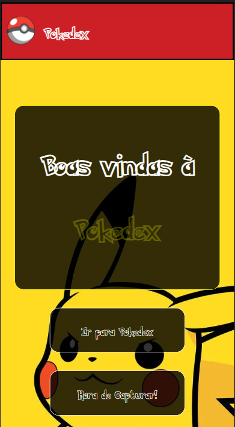
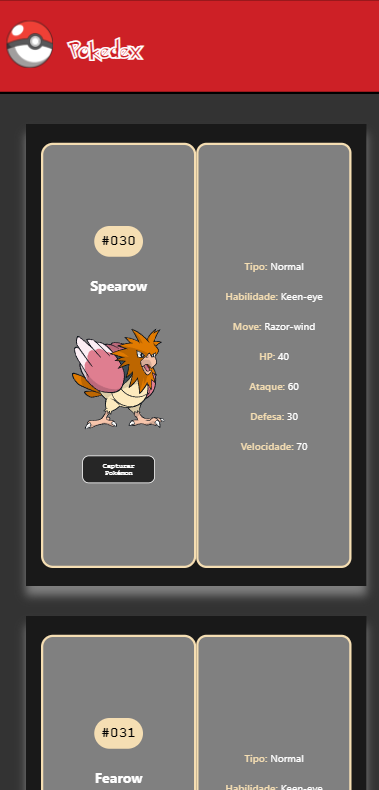
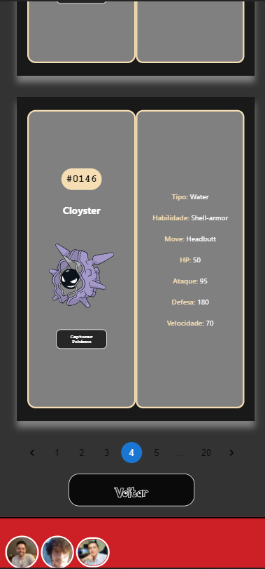
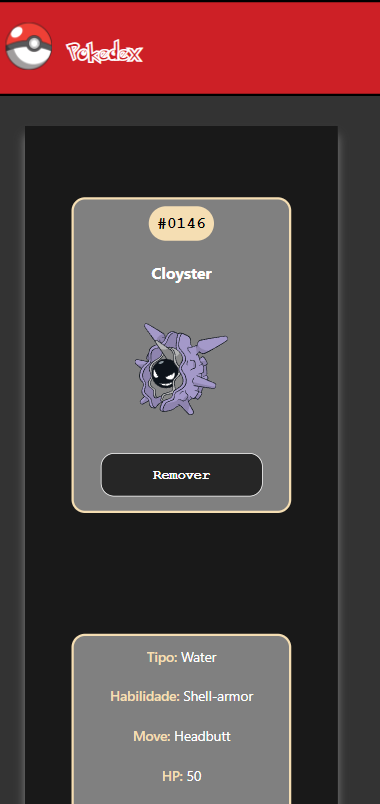
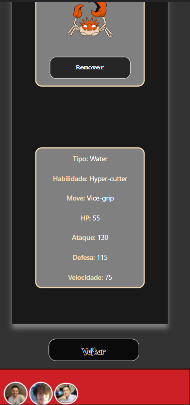
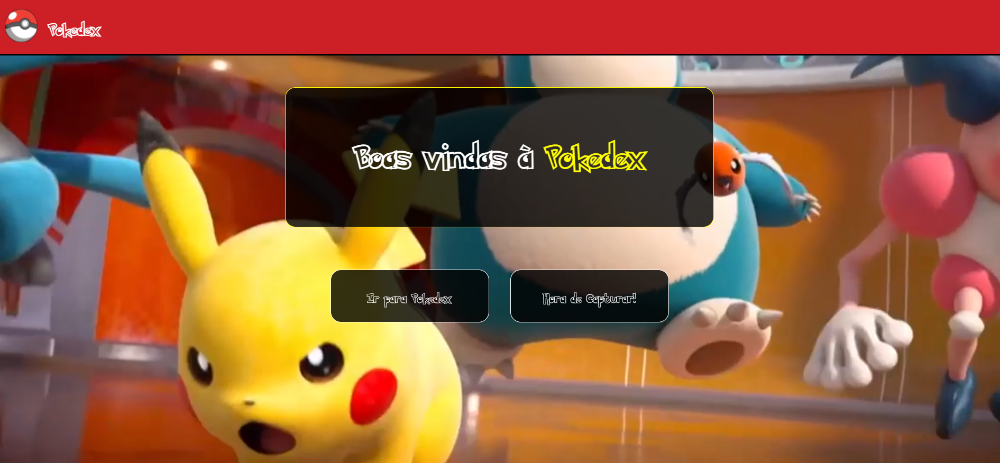
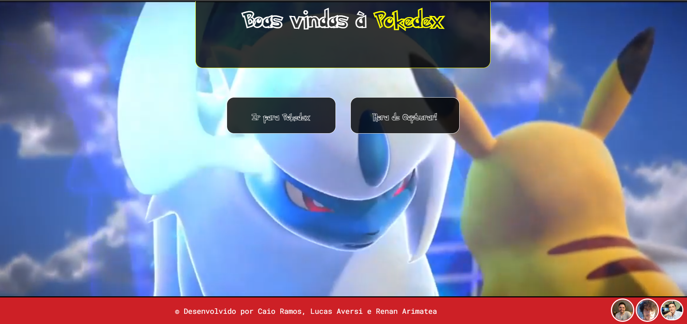
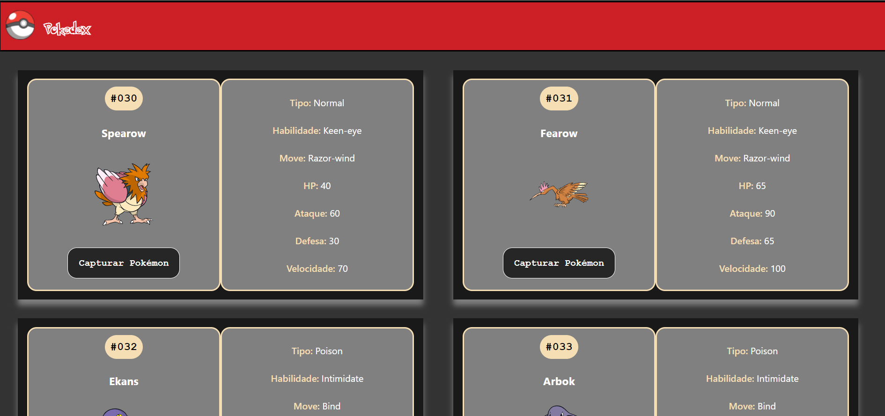
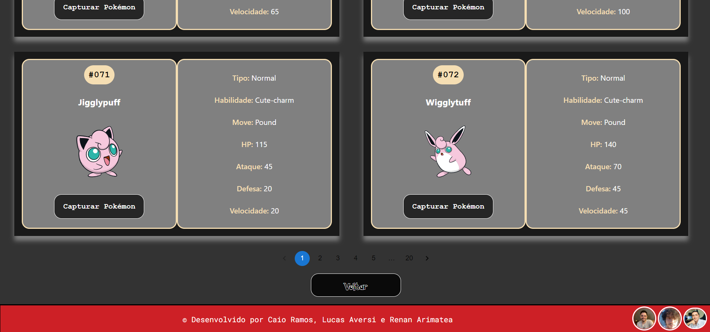

# Projeto de Fixação: Pokedex

## Olá Terráqueos! 🖖👽

Este é um Projeto de Fixação do curso Web Full Stack da Labenu.

## 💬 Sobre o projeto:

Este projeto consiste em criar uma pokedex consumindo uma API, com informações de Pokemons.

## 👩‍💻 Linguagens Usadas:

* CSS;

* HTML;

* JAVASCRIPT.

## 📚 Bibliotecas Usadas:

* ReactJS;

## 🔗 Link do Surge:

[Pokedex]()

## O que funciona?

- [X] Home
    - O usuário deve ser capaz de acessar o site principal através de um botão.
- [X] Página de Listagem de Pokemons:
    - O usuário deve receber uma lista de pokemons vinda da API. Ele pode armazenar Pokemons em sua Pokedex clicando em cada um.    
- [x] Pokedex
    - O usuário deve pode ver os Pokemons que foram adicionados em sua Pokedex.
- [X] Detalhamento do Pokemon
    - Ao usuário deve ser possível ir para uma página de detalhes do Pokemon ao clicar no mesmo, estando tanto na Home quanto na Pokedex.    

### Instalação

Para rodar o projeto na máquina local é necessário a instalação do node js:
- [NodeJS](https://nodejs.org/en/download/)

### 🧭 Rodando a aplicação web
Tendo o node js instalado, efetue o comando para instalar as dependências necessários para rodar o projeto localmente:
```
npm install 
```
<br/>

Pós instalação das dependências, execute o comando necessário para rodar o projeto:

`npm start`

<br/>

Por padrão a aplicação rodará localmente na porta 3000.

<br/>

### Créditos

* Caio Ramos - 👋🏽
* Lucas Aversi - 👋🏽
* Renan Arimatea - 👋🏽

## 📷 Screenshots 











